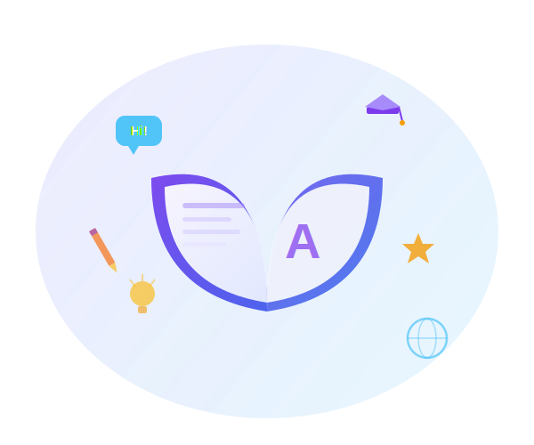
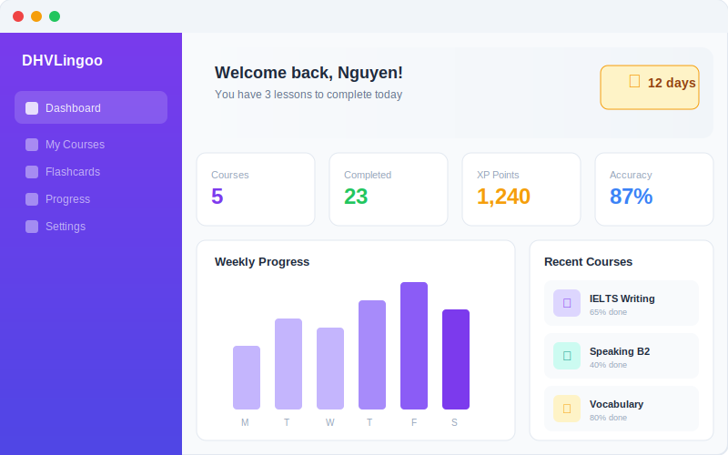

<div align="center">

# 🦊 DHV-Lingoo

### Nền tảng học tiếng Anh thông minh với AI

[](https://nextjs.org/)
[](https://supabase.com/)
[](https://typescriptlang.org/)
[](https://tailwindcss.com/)
[](https://dhv-lingoo.vercel.app)

**[🌐 Live Demo](https://dhv-lingoo.vercel.app)** · **[📖 Tài liệu](#cấu-trúc-dự-án)** · **[🐛 Báo lỗi](https://github.com/maitamdev/DHV-Lingoo/issues)**

</div>

---

## 📋 Giới thiệu

**DHV-Lingoo** là đồ án chuyên ngành — một nền tảng học tiếng Anh toàn diện được xây dựng với công nghệ hiện đại. Ứng dụng cung cấp trải nghiệm học tập cá nhân hóa với trợ lý AI, hệ thống gamification, và bài học tương tác đa phương tiện.

### ✨ Điểm nổi bật

- 🤖 **Fox AI Chatbot** — Trợ lý học tập AI (Groq SDK) hỗ trợ đàm thoại tiếng Anh
- 🗺️ **Lộ trình AI cá nhân hóa** — Tạo roadmap riêng dựa trên trình độ và mục tiêu
- 🎮 **Gamification** — Hệ thống XP, streak, thành tựu, bảng xếp hạng
- 📱 **Responsive** — Tối ưu cả desktop và mobile
- 🔔 **Web Push Notification** — Nhắc nhở học tập kể cả khi tắt web
- 🔊 **Text-to-Speech** — Phát âm từ vựng bản ngữ

---

## 🚀 Tính năng

### Học viên
| Tính năng | Mô tả |
|---|---|
| 📚 **Khóa học đa cấp** | Bài học từ A1 → C2 với video, từ vựng, hội thoại |
| 🧠 **Quiz thông minh** | Trắc nghiệm, fill-blank, matching, unscramble |
| 🗣️ **Speaking & Listening** | Luyện nói/nghe với TTS bản ngữ |
| 📝 **Flashcards** | Ôn tập từ vựng với thẻ lật |
| 📊 **Dashboard** | Biểu đồ thống kê tiến trình, XP, streak |
| 🏆 **Thành tựu** | Huy chương và badge khi đạt cột mốc |
| ⚙️ **Cài đặt hồ sơ** | Upload avatar, chỉnh thông tin, chọn mục tiêu |
| 💳 **Gói Premium** | UI đăng ký gói (Free / Premium / Trọn đời) |

### Hệ thống
| Tính năng | Mô tả |
|---|---|
| 🔐 **Authentication** | Đăng ký/đăng nhập với Supabase Auth |
| 👨‍💼 **Admin Panel** | Quản lý khóa học, bài học, nội dung |
| 🔔 **Notifications** | Chuông thông báo in-app + Web Push |
| 📱 **Mobile Menu** | Hamburger menu responsive |
| 💀 **Loading Skeleton** | UI shimmer animation khi tải trang |
| 🌐 **OG Meta Tags** | Preview ảnh khi chia sẻ link lên mạng xã hội |

---

## 🛠️ Công nghệ

```
Frontend:    Next.js 15 (App Router) + React 19 + TypeScript
Styling:     Tailwind CSS 4 + Lucide Icons
Database:    Supabase (PostgreSQL + RLS)
Auth:        Supabase Auth
Storage:     Supabase Storage (avatars)
AI:          Groq SDK (LLaMA 3) + Hugging Face
Push:        Web Push API + Service Worker
Charts:      Recharts
Deployment:  Vercel + Vercel Cron
```

---

## 📁 Cấu trúc dự án

```
DHV-Lingoo/
├── public/               # Static assets (images, SW)
│   ├── images/           # Logo, OG cover, course thumbnails
│   └── sw.js             # Service Worker for push notifications
├── src/
│   ├── app/              # Next.js App Router
│   │   ├── dashboard/    # Dashboard pages
│   │   │   ├── courses/  # Khóa học + bài học
│   │   │   ├── settings/ # Cài đặt hồ sơ
│   │   │   ├── roadmap/  # Lộ trình AI
│   │   │   ├── flashcards/
│   │   │   ├── practice/
│   │   │   ├── achievements/
│   │   │   └── subscription/
│   │   ├── admin/        # Admin panel
│   │   ├── api/          # API routes
│   │   │   ├── fox-chat/ # Fox AI chatbot
│   │   │   ├── generate-roadmap/
│   │   │   ├── push-subscribe/
│   │   │   └── send-push/
│   │   ├── login/
│   │   ├── register/
│   │   └── onboarding/
│   ├── components/       # React components
│   │   ├── dashboard/    # Dashboard UI components
│   │   ├── landing/      # Landing page components
│   │   ├── auth/         # Auth components
│   │   └── ui/           # Shared UI (Skeletons, etc.)
│   └── lib/              # Utilities
│       └── supabase/     # Supabase client/server
├── supabase/             # Database schemas & seeds (gitignored)
└── vercel.json           # Cron job configuration
```

---

## ⚡ Cài đặt & Chạy

### Yêu cầu
- Node.js 18+
- npm hoặc yarn
- Tài khoản [Supabase](https://supabase.com)

### Bước 1: Clone

```bash
git clone https://github.com/maitamdev/DHV-Lingoo.git
cd DHV-Lingoo
npm install
```

### Bước 2: Cấu hình môi trường

Tạo file `.env.local`:

```env
NEXT_PUBLIC_SUPABASE_URL=your_supabase_url
NEXT_PUBLIC_SUPABASE_ANON_KEY=your_supabase_anon_key
GROQ_API_KEY=your_groq_api_key
HUGGINGFACE_API_KEY=your_huggingface_key
NEXT_PUBLIC_VAPID_PUBLIC_KEY=your_vapid_public_key
VAPID_PRIVATE_KEY=your_vapid_private_key
CRON_SECRET=your_cron_secret
```

### Bước 3: Setup Supabase

1. Tạo project trên [Supabase Dashboard](https://app.supabase.com)
2. Chạy các file SQL schema theo thứ tự trong **SQL Editor**
3. Tạo Storage bucket `avatars` (Public)
4. Cấu hình RLS policies

### Bước 4: Chạy

```bash
npm run dev
```

Mở [http://localhost:3000](http://localhost:3000) 🚀

---

## 🗄️ Database Schema

| Bảng | Mô tả |
|---|---|
| `profiles` | Thông tin người dùng, XP, streak, level |
| `courses` | Khóa học |
| `lessons` | Bài học trong khóa |
| `lesson_vocabularies` | Từ vựng bài học |
| `lesson_dialogues` | Hội thoại bài học |
| `lesson_exercises` | Bài tập/quiz |
| `lesson_sections` | Sections nội dung |
| `lesson_progress` | Tracking tiến trình |
| `notifications` | Thông báo in-app |
| `push_subscriptions` | Web Push subscriptions |

---

## 🚢 Deploy

### Vercel (Khuyến nghị)

1. Import repo lên [Vercel](https://vercel.com)
2. Thêm **Environment Variables** (xem Bước 2)
3. Deploy tự động khi push lên `main`

### Environment Variables trên Vercel

| Variable | Mô tả |
|---|---|
| `NEXT_PUBLIC_SUPABASE_URL` | Supabase project URL |
| `NEXT_PUBLIC_SUPABASE_ANON_KEY` | Supabase anon key |
| `GROQ_API_KEY` | Groq API key cho Fox AI |
| `NEXT_PUBLIC_VAPID_PUBLIC_KEY` | VAPID public key |
| `VAPID_PRIVATE_KEY` | VAPID private key |
| `CRON_SECRET` | Secret cho cron endpoint |

---

## 📸 Screenshots

<div align="center">

| Landing Page | Dashboard |
|:---:|:---:|
|  |  |

</div>

---

## 👥 Tác giả

**Mai Tâm** — [@maitamdev](https://github.com/maitamdev)

> 📌 Đồ án chuyên ngành — Đại học DHV

---

## 📄 License

Dự án này là **bản quyền riêng** (Proprietary). Không được phép sao chép, phân phối, hoặc sử dụng cho mục đích thương mại mà không có sự cho phép bằng văn bản.

© 2024-2026 Mai Tâm. All rights reserved.
